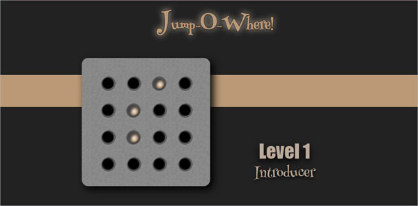

# Jump-O-Where
## A browser based solitaire game using html/css/js
  

  

## About the game
---
**Jump-O-Where** is a minimal game inspired by popular *[Peg solitair](https://en.wikipedia.org/wiki/Peg_solitaire)* gaming theme.
**Jump-O-Where** is a special adaptation of Peg solitaire to a minimal 4x4 board game platform, with multi level gaming principal. Original game design, rules, levels shape and names and any related materials is done by myself. **Jump-O-Where** is a member of my minimal game design collection *[Horian Booms](https://www.instagram.com/explore/tags/horianbooms/top/?hl=en)*

If you want to take it a try, you can go straight to *[Play Jump-O-Where](https://samiamehrdad.github.io/Jump-O-Where/)*, there is also a simple 'How to play' instruction if you head to the game logo there !
## About this implementation
---
This instance of Jump-O-Where is developed with a vision of simplicity and elegance. There is 20 different named levels, sorted from easy to difficult. Playing is done just by clicking on a peg and then on highlighted destination, if there is any.

---
 

## Technical aspects
There is some specifications about this implementation:
* Only pure HTML, CSS and JavaScript ( Vanilla ) is used.
* No any 3rd party library or frameworks is used.
* Following MVC software development pattern.
* Responsive design.
* Keeping files size and network requests as low as possible.
* Browser compatibility tested by [BrowserStac](khttps://www.browserstack.com/)

## Next steps :
* Saving current level for next playing session.
* Implementing mandatory finish point version.
* Time and records keeping feature plus ability to share it. 
* Adding some random motivation messages and music.
* Adding some extra levels.
  
## Copyrights :
---
All graphics, layout designs and necessary images are created by myself.
Some of sound effects are downloaded from [freesound.org](https://freesound.org/) and edited by me using non commercial version of [Wave Pad](https://www.nch.com.au/wavepad/index.html)